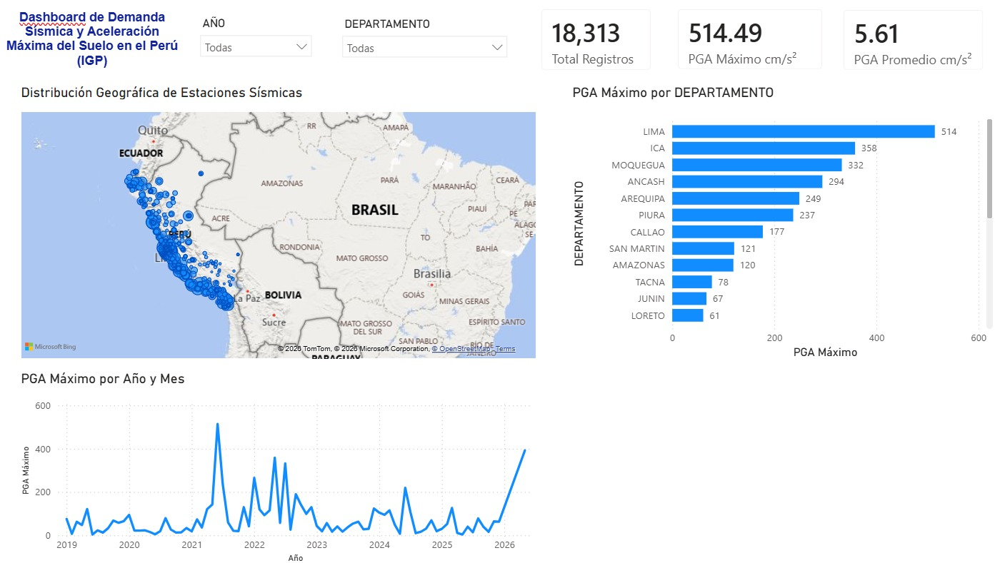

# 🌋 Dashboard de Demanda Sísmica y Aceleración Máxima del Suelo en el Perú (2019–2026)

## 📌 Descripción

Este proyecto implementa un **pipeline end-to-end de datos** para procesar, transformar y analizar registros de **Aceleración Máxima del Suelo (PGA)** emitidos por la Red Sísmica Nacional del **Instituto Geofísico del Perú (IGP)** mediante el servicio **ACELDAT_Perú**.

El objetivo es evaluar la intensidad y distribución espacial y temporal de la demanda sísmica generada por eventos de **magnitud ≥ 4.5**, permitiendo identificar las regiones, distritos y estaciones acelerométricas con mayores niveles de aceleración.

## 🛠️ Tecnologías y Herramientas

* **Python 3.x:** Pandas y NumPy para automatización del ETL, limpieza e ingeniería de características.
* **Power BI Desktop:** DAX y Power Query para el modelado, análisis y visualización.
* **Git / GitHub:** Control de versiones y documentación.
* **Fuente de datos:** Instituto Geofísico del Perú (IGP) / Plataforma Nacional de Datos Abiertos.

## 📸 Dashboard



## ⚙️ Proceso ETL

El procesamiento implementado en `analisis.py` incluye:

### Ingeniería de características

Se combinaron las tres componentes de aceleración sísmica (**Z, N-S y E-O**) para obtener la **PGA resultante**:

```text
PGA_RESULTANTE = √(ACEL_VERTICAL² + ACEL_NORTE_SUR² + ACEL_ESTE_OESTE²)
```

### Limpieza temporal

* Inferencia de fechas mediante respaldo entre `FECHA_EVENTO` y `FECHA_CORTE`.
* Formateo de horas mediante el formato estricto `HHMMSS`.
* Tratamiento de fechas nulas (`NaT`).

### Formateo geoespacial

* Estandarización del código `UBIGEO` a 6 dígitos mediante `str.zfill(6)`.
* Preparación para compatibilidad con capas GIS y herramientas cartográficas del Perú.

## 📊 Principales Hallazgos

* **Pico histórico:** Lima registró el mayor valor de demanda sísmica, con **514.49 cm/s²** en la estación **Lurín (LURN)** durante el evento del **22 de junio de 2021**.
* **Top departamentos:**

  1. **Lima:** 514.49 cm/s²
  2. **Ica:** 358.00 cm/s²
  3. **Moquegua:** 332.00 cm/s²
  4. **Áncash:** 294.00 cm/s²
* **Promedio nacional:** **5.61 cm/s²**.

## 📁 Estructura del Repositorio

```text
Analisis-Demanda-Sismica-Peru-IGP/
├── .gitignore
├── ACELDAT_Peru_Procesado.csv
├── IGP_ACELDAT_Peru_2019-2025_Diccionario...
├── analisis.py
├── dashboard.pbix
├── README.md
└── img/
    └── dashboard_preview.jpeg
```

## 👨‍💻 Autor

**Kenji Chavez Tapia**

Estudiante de Ingeniería de Sistemas e Informática, con interés en Análisis de Datos, Business Intelligence y desarrollo de soluciones utilizando Power BI, SQL y Python.
